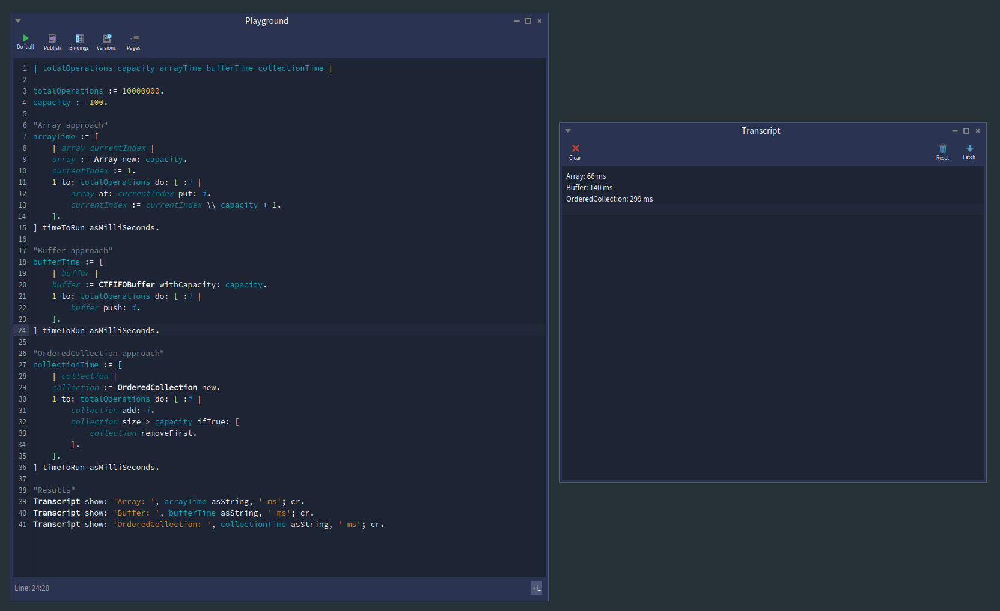
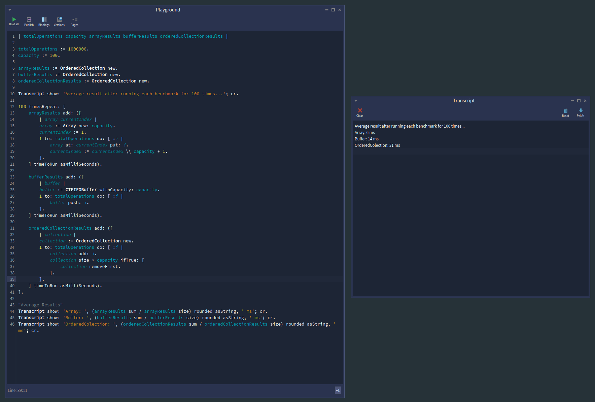

# Circular Buffers in Pharo: A Better Way to Handle Recent Data

### The Problem: Managing Recent Data is Harder Than It Looks

Every developer faces this challenge: keeping track of the last N items efficiently. Whether it's recent chat messages, browser history, or sensor readings, the naive approach quickly becomes problematic:

```smalltalk
"Current Approach"
recentMessages := OrderedCollection new.
recentMessages add: newMessage.
recentMessages size > 100 ifTrue: [ 
    recentMessages removeFirst  "Ouch! This shifts 99 elements EVERY time"
].
```

This innocent-looking code has serious flaws:
- **Performance degradation**: Each `removeFirst` becomes slower as the collection grows
- **Memory spikes**: Collection grows before cleanup
- **Complexity**: Manual size management and error-prone logic

### The Solution: Circular Buffers

A Circular buffer is a fixed-size data structure that automatically overwrites the oldest data when it reaches capacity. Think of it as a smart parking lot with exactly N spaces - when full, new cars automatically replace the oldest parked cars.

### Key Benefits
- **Constant Memory Usage**: Never grows beyond specified capacity
- **O(1) Performance**: Lightning-fast operations regardless of data volume  
- **Zero Memory Leaks**: Automatic cleanup of old data
- **Streaming Optimized**: Designed for continuous data flow
- **Flexible Ordering**: Choose FIFO or LIFO based on your needs

```smalltalk
"Circular buffer approach - elegant and efficient"
recentMessages := CTFIFOBuffer withCapacity: 100.
recentMessages push: newMessage.  "That's it! Always O(1) & No Manual Cleanup"
```

### Pharo provides two types of circular buffers:
- **FIFO Buffer**: First In, First Out (Queue behavior)
- **LIFO Buffer**: Last In, First Out (Stack behavior)


### FIFO Buffer: Deep Dive with Example

FIFO buffers work like a queue - the first element added is the first one retrieved.

### Dry Run Example
```smalltalk
buffer := CTFIFOBuffer withCapacity: 2.
buffer push: 'A'.     "Buffer state: [A, _] readIndex=1, writeIndex=2"
buffer push: 'B'.     "Buffer state: [A, B] readIndex=1, writeIndex=1" 
buffer push: 'C'.     "Buffer state: [C, B] readIndex=2, writeIndex=2 (A overwritten)"
buffer pop.           "Returns 'B', Buffer state: [C, _] readIndex=1, writeIndex=2"
buffer pop.           "Returns 'C', Buffer state: [_, _] (empty)"
```

**Key Insight**: Notice how 'A' was automatically overwritten when 'C' was added, and we retrieved elements in chronological order: B (oldest remaining), then C (newest).

### Real-World Example: Chat Application

```smalltalk
"Chat room that keeps last 4 messages for display"
chatHistory := CTFIFOBuffer withCapacity: 4.

"Users send messages throughout the day"
chatHistory push: 'Alok: Hello everyone!'.
chatHistory push: 'Sebastian: Hey Alok, how are you?'.
chatHistory push: 'Gordana: Great to see you both!'.
chatHistory push: 'Alok: Sorry I was late to the party!'.

"Buffer now contains exactly 4 messages in chronological order"

"New message arrives - oldest automatically disappears"
chatHistory push: 'Sebastian: No worries Alok, welcome!'.

"Display current message history (oldest to newest)"
displayedMessages := OrderedCollection new.
[ chatHistory isEmpty ] whileFalse: [
    displayedMessages add: chatHistory pop
].

"displayedMessages now contains (in chronological order):"
"1. 'Sebastian: Hey Alok, how are you?' (oldest remaining)"
"2. 'Gordana: Great to see you both!'"
"3. 'Alok: Sorry I was late to the party!'"
"4. 'Sebastian: No worries Alok, welcome!' (newest)"

"Notice: Alok's first message was automatically removed to make space"
```

**Why FIFO for Chat:**
- Messages display in natural conversation flow
- Oldest messages automatically scroll out of view
- Zero manual memory management
- Perfect for streaming conversation history

## LIFO Buffer: Deep Dive with Example

LIFO buffers work like a stack - the last element added is the first one retrieved.

### Dry Run Example
```smalltalk
buffer := CTLIFOBuffer withCapacity: 2.
buffer push: 'A'.     "Buffer state: [A, _] readIndex=1, writeIndex=2"
buffer push: 'B'.     "Buffer state: [A, B] readIndex=2, writeIndex=1"
buffer push: 'C'.     "Buffer state: [C, B] readIndex=1, writeIndex=2 (A overwritten)"
buffer pop.           "Returns 'C', Buffer state: [_, B] readIndex=2"
buffer pop.           "Returns 'B', Buffer state: [_, _] (empty)"
```

**Key Insight**: Elements are retrieved in reverse order - most recent first. This is perfect for "undo" scenarios and recent-item access patterns.

### Real-World Example: Browser History Navigation

```smalltalk
"Browser that remembers last 3 visited pages"
browserHistory := CTLIFOBuffer withCapacity: 3.

"User browses during the day"
browserHistory push: 'https://pharo.org'.
browserHistory push: 'https://github.com/pharo-containers'.
browserHistory push: 'https://stackoverflow.com'.

"User clicks back button twice"
previousPage := browserHistory pop.  
"Returns: 'https://stackoverflow.com' (most recent)"
previousPage := browserHistory pop.
"Returns: 'https://github.com/pharo-containers'"

"User visits new pages"
browserHistory push: 'https://news.ycombinator.com'.
browserHistory push: 'https://medium.com/programming-articles'.
browserHistory push: 'https://reddit.com/r/programming'.  "This overwrites 'https://pharo.org'!"

"User clicks back button - gets most recent first"
previousPage := browserHistory pop.
"Returns: 'https://reddit.com/r/programming' (newest)"
previousPage := browserHistory pop.
"Returns: 'https://medium.com/programming-articles'"
previousPage := browserHistory pop.
"Returns: 'https://news.ycombinator.com'"

"Notice: 'https://pharo.org' is gone - got overwritten when buffer was full!"
```

**Why LIFO for Browser History:**
- Back button should show most recent page first
- Natural stack behavior matches user expectations
- Automatically forgets old history when limit reached
- Ideal for any "recent items" functionality

## Performance Analysis: The Numbers Speak

I conducted comprehensive performance tests comparing three approaches i.e Arrays, Circular Buffers & Ordered Collections for maintaining the last 100 items. Here's what the data reveals:

### Test Run 1: Individual Performance



The first screenshot shows a single test run where I measured the execution time for each approach. You can see in the transcript:

- **Array**: 66ms
- **Buffer**: 140ms
- **OrderedCollection**: 299ms

This shows the relative performance - OrderedCollection is clearly the slowest due to all those expensive removeFirst operations.
### Test Run 2: Average Performance



The second screenshot shows the average execution time over 100 test runs. The results are as follows:

- **Array**: ~6 ms
- **Buffer**: ~14 ms
- **OrderedCollection**: ~31 ms

These averages confirm the trends observed in the individual test run - Circular Buffers provide a solid middle ground between raw speed and ease of use, while Ordered Collections lag behind due to their inherent inefficiencies.

### Test Run 3: Performance Benchmark

Using Pharo's bench method to measure sustained performance, measured in operations per 5 seconds. The results are:

- **Array**: ~756 iterations/5sec
- **Buffer**: ~351 iterations/5sec
- **OrderedCollection**: ~170 iterations/5sec

### Why These Results Matter

- **Array (Manual Management)**
  - Fastest performance
  - Requires manual index logic and careful boundary checks
  - Easy to introduce bugs & Hard to maintain

- **Circular Buffer**
  - Nearly as fast as arrays
  - Delivers 43% of Array speed while eliminating 100% of the complexity
  - Automatically manages size
  - Clean, safe, and maintainable for most use cases

- **OrderedCollection**
  - Slowest performance
  - Gets destroyed by `removeFirst` operations that shift hundreds of elements every time
  - Not suitable for high-volume data management
